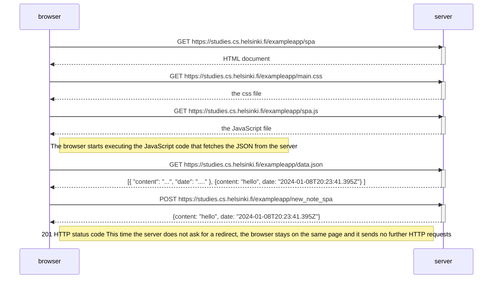

```mermaid
sequenceDiagram
    participant browser
    participant server
    browser->>server: GET https://studies.cs.helsinki.fi/exampleapp/spa
    activate server
    server-->>browser: HTML document
    deactivate server
    browser->>server: GET https://studies.cs.helsinki.fi/exampleapp/main.css
    activate server
    server-->>browser: the css file
    deactivate server
    browser->>server: GET https://studies.cs.helsinki.fi/exampleapp/spa.js
    activate server
    server-->>browser: the JavaScript file
    deactivate server
    Note right of browser: The browser starts executing the JavaScript code that fetches the JSON from the server
    browser->>server: GET https://studies.cs.helsinki.fi/exampleapp/data.json
    activate server
    server-->>browser: [{ "content": "...", "date": "...." }, {content: "hello", date: "2024-01-08T20:23:41.395Z"}  ]
    deactivate server
    browser->>server: POST https://studies.cs.helsinki.fi/exampleapp/new_note_spa
    activate server
    server-->>browser: {content: "hello", date: "2024-01-08T20:23:41.395Z"}
    deactivate server
    Note left of server:201 HTTP status code This time the server does not ask for a redirect, the browser stays on the same page and it sends no further HTTP requests


```
